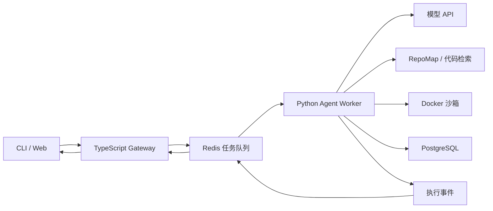

# RepoPilot

RepoPilot 是一个仓库级 AI Coding Agent。

用户输入代码仓库和 Issue 后，RepoPilot 可以检索相关代码、制定修改计划、调用工具修改文件、运行测试，并根据测试错误重新修复，最终输出 Git Diff 和完整执行轨迹。

## 当前状态

RepoPilot 正处于 MVP 开发阶段。

已完成：

- [x] 产品 PRD
- [x] Agent 状态设计
- [x] 工具清单与安全边界
- [x] Python 项目配置
- [x] pytest 测试骨架

待完成：

- [ ] TypeScript Gateway
- [ ] Python Agent Worker
- [ ] 只读代码工具
- [ ] 修改和测试工具
- [ ] Planner、Executor、Verifier
- [ ] Docker 沙箱
- [ ] 评测任务集

## 系统架构



## Agent 执行闭环

```text
Issue
→ 校验工作区
→ 生成 RepoMap
→ 制定计划
→ 调用工具
→ 修改代码
→ 运行测试
→ 验证结果
→ 失败重试或成功结束
```

## 项目结构

```text
repopilot/
├── apps/
│   └── gateway/              # TypeScript API 和事件推送
├── services/
│   └── agent/                # Python Agent Worker
├── packages/
│   └── protocol/             # TS/Python 共用协议
├── evals/
│   └── fixtures/             # 示例故障仓库
├── docs/
│   ├── PRD.md
│   ├── STATE_MACHINE.md
│   └── TOOLS.md
├── pyproject.toml
└── README.md
```

## 本地开发

要求：

- Python 3.12+
- Node.js 24+
- pnpm 10+
- ripgrep 15+
- Git
- Docker（Day 4 引入）

创建并激活 Python 虚拟环境：

```powershell
python -m venv .venv
.\.venv\Scripts\Activate.ps1
```

安装项目：

```powershell
python -m pip install -e ".[dev]"
```

运行测试：

```powershell
python -m pytest
```

检查代码：

```powershell
python -m ruff check .\services\agent
```

## MVP 成功标准

给定一个带失败测试的 Python 仓库和 Issue，Agent 能够找到相关代码、生成并应用补丁、运行 pytest，并在失败后至少完成一次有效修复，最终输出 Git Diff 和执行轨迹。

## 安全原则

- 模型不能指定工作区根目录
- 模型不能执行任意 Shell 命令
- 所有路径必须经过工作区边界校验
- 所有工具都有超时、输出限制和结构化错误
- 所有修改和测试过程都必须留下轨迹