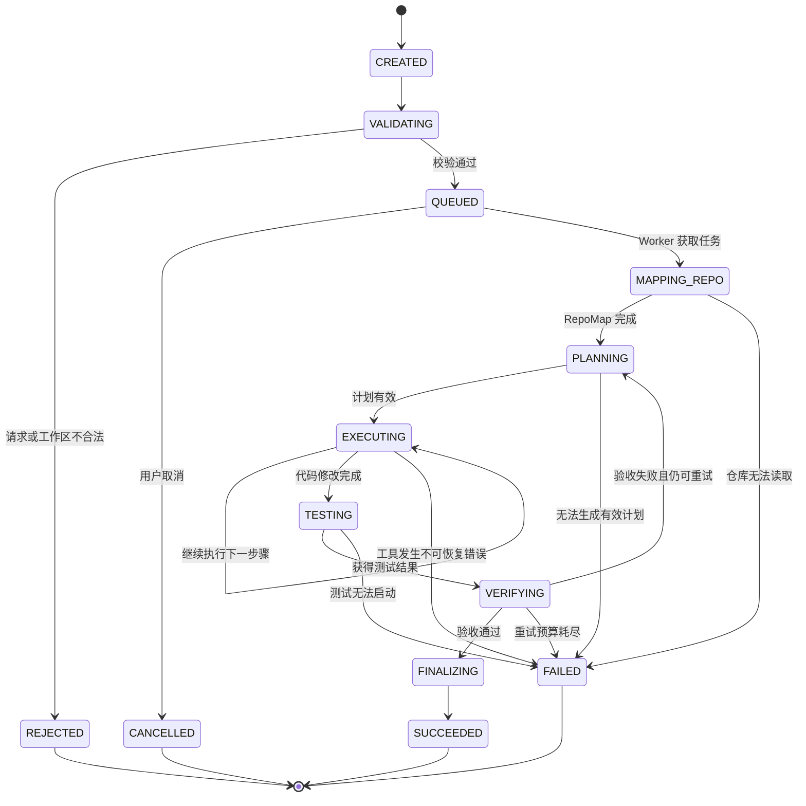

# RepoPilot 状态机 v0.1

## 1. 两层状态设计

RepoPilot 将状态分成两层：

- `TaskStatus`：提供给 Gateway、队列和用户，描述任务整体状态。
- `AgentPhase`：提供给 Agent Worker，描述当前执行阶段。

这样可以避免把“正在测试”“正在规划”等内部细节全部塞进任务状态。

## 2. TaskStatus

| 状态 | 含义 |
|---|---|
| `CREATED` | 任务已经创建，尚未校验 |
| `QUEUED` | 任务校验通过，等待 Worker |
| `RUNNING` | Worker 正在执行 |
| `SUCCEEDED` | 任务成功完成 |
| `FAILED` | 任务执行失败 |
| `CANCELLED` | 用户主动取消 |
| `REJECTED` | 请求或工作区不合法 |

## 3. AgentPhase

| 阶段 | 含义 |
|---|---|
| `VALIDATING` | 校验 Issue、工作区和参数 |
| `MAPPING_REPO` | 生成仓库地图 |
| `PLANNING` | 生成或更新执行计划 |
| `EXECUTING` | 调用代码工具 |
| `TESTING` | 运行测试并保存原始结果 |
| `VERIFYING` | 判断修改是否满足任务目标 |
| `FINALIZING` | 生成 Diff 和最终报告 |

## 4. 状态图

## 5. 核心转换规则

1. 只有校验通过的任务才能进入队列。
2. 只有 Worker 成功获取任务后，任务才进入 `RUNNING`。
3. 每次状态转换必须保存时间、原因和关联事件。
4. 测试失败不一定代表任务失败，可以返回 `PLANNING`。
5. 工具错误分为可恢复错误和不可恢复错误。
6. 超过步骤、重试、时间或 Token 预算时进入 `FAILED`。
7. `SUCCEEDED`、`FAILED`、`CANCELLED`、`REJECTED` 是终态。
8. 终态任务不能继续调用工具。
9. 相同事件重复到达时不能重复执行副作用操作。

## 6. TESTING 与 VERIFYING 的区别

`TESTING` 负责执行测试并记录退出码、标准输出、错误输出和耗时。

`VERIFYING` 负责根据测试结果、Git Diff、安全规则和 Issue 目标判断任务是否真正完成。