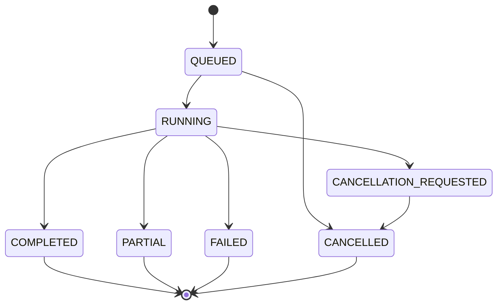

# 任务状态：怎样知道它进行到了哪里

更新日期：2026-09-07。下面使用当前 Gateway 和 Worker 的实际状态名称。

## 先分清三种“状态”

任务状态说的是整张工单有没有开始、结束或取消；事件说的是执行过程中刚刚发生了什么；工具状态说的是一次读文件、打补丁或运行检查有没有成功。

一次工具失败，不一定代表整个任务马上失败。Agent 可能读懂错误后再试一次。

## Gateway / Worker 任务状态

| 状态 | 大白话含义 | 是否结束 |
| --- | --- | --- |
| `QUEUED` | 已经接单，正在排队。 | 否 |
| `RUNNING` | Worker 已领取，正在执行。 | 否 |
| `CANCELLATION_REQUESTED` | 收到取消请求，正在等待执行端停止。 | 否 |
| `CANCELLED` | 任务已经取消。 | 是 |
| `COMPLETED` | 本次执行报告为完成。 | 是 |
| `PARTIAL` | 主 Agent 完成，但部分子调查没有完成，或汇总存在冲突。 | 是 |
| `FAILED` | 本次执行没有正常完成。 | 是 |

这是主要流程示意。取消和任务自然结束可能同时发生，最终状态以服务返回的任务记录为准。

`CANCELLED` 只会在 Gateway 收到取消请求后出现。空工作区、模型异常和 Worker 超时不会
自动写成取消；这些执行异常应进入 `FAILED`。关闭 Desktop 的事件流也不等于取消任务。

当前公开协议没有 `CREATED`、`SUCCEEDED` 或 `REJECTED` 这几个任务状态。它们出现在早期设计稿中；请求格式不合法时，Gateway 会返回 HTTP 错误，不会给你一个名为 `REJECTED` 的已排队任务。

## 为什么已经有结果还可能是 PARTIAL

例如三个子 Agent 中，有一个调查超时了，主 Agent 仍利用其余证据完成了修改。或者多个调查结果互相矛盾，需要保留提示。

此时你应查看 `subagents`、`aggregation.conflicts` 和主 Agent 的结果，而不是把 `PARTIAL` 理解为“代码只写了一半”。

## 运行过程看事件

| 事件 | 表示什么 |
| --- | --- |
| `PLANNING_STARTED` / `PLANNING_COMPLETED` | 开始判断路由并按需拆分任务 / 规划结束。 |
| `DISPATCH_STARTED` / `DISPATCH_COMPLETED` | 开始安排子 Agent / 子调查结束。 |
| `MODEL_REQUESTED` / `MODEL_RESPONDED` | 发出模型请求 / 收到回应。 |
| `TOOL_REQUESTED` / `TOOL_COMPLETED` | 请求运行工具 / 工具有了结果。 |
| `VERIFICATION_REQUIRED` | 还有改动没有完成框架要求的验证。 |
| `CONTEXT_COMPACTED` | 历史内容进行了压缩。 |
| `MEMORY_RECALLED` | 召回了参考记忆。 |
| `AGENT_COMPLETED` / `AGENT_FAILED` | 一个 Agent 的执行结束。 |
| `TRACE_COMPLETED` / `TRACE_FAILED` | 整条执行轨迹结束。 |

旧文档中的 `AgentPhase` 和 `PLANNING -> EXECUTING -> VERIFYING` 可用于解释概念，不应当作当前 API 一定提供的字段。

## 工具状态

`SUCCESS` 表示这次工具调用成功；`ERROR` 表示执行出错；`REJECTED` 表示不符合工具限制；`TIMEOUT` 表示超时。这里的 `REJECTED` 属于工具结果，不属于上面的任务状态。

## 代码改完为什么不能直接结束

打补丁后，Agent 会把“测试已通过”和“静态检查已通过”的标志重置。它需要在修改后重新获得成功的测试结果，并让 Ruff lint 覆盖改动文件。

只有结果中的 `tests_passed` 为真，仍不足以替代 `quality_checks_passed`。更早的历史记录可能还没有后者，阅读旧记录时应保留当时的版本背景。

`direct` 普通回复不运行 Docker 或 Ruff，Desktop 应显示“未运行”，不能把缺少验证执行
误写成“未通过”。

## 对应代码

- `apps/gateway/src/domain/protocol.ts`：TypeScript 任务状态。
- `services/agent/src/bit_agent/worker/models.py`：Python 任务状态。
- `services/agent/src/bit_agent/worker/service.py`：Worker 执行和状态回写。
- `services/agent/src/bit_agent/agent/result.py`：单 Agent 结果。
- `services/agent/src/bit_agent/multi_agent/models.py`：多 Agent 结果和子任务状态。
- `services/agent/src/bit_agent/observability/events.py`：执行事件。
